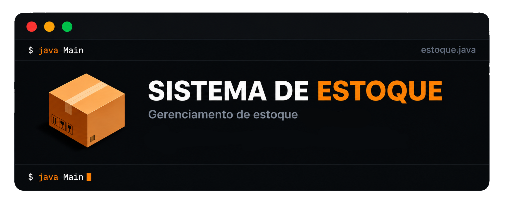

<p align="center">
  
</p>

# Sistema de Estoque — Completo

Sistema de gerenciamento e conferência de estoque desenvolvido em **Java 17**, com API REST, PostgreSQL, Maven e dois painéis: Gerente e Funcionário.

---

## Sobre o projeto

O **Estoque-Sistema-Completo** é a terceira e última etapa de uma evolução em três repositórios:

1. **[Estoque-Console](https://github.com/nahhay/Sistema-de-Estoque-Console)** — modelagem do domínio e do fluxo em POO, sem persistência.
2. **[Estoque-Conferencia](https://github.com/nahhay/Sistema-de-Estoque-Conferencia)** — evolução com API REST, PostgreSQL e dois painéis web.
3. **Estoque-Sistema-Completo** *(este repositório)* — versão consolidada, com Maven, tratamento de exceções por camada, fluxo completo de reposição (solicitar → separar → conferir → entregar/cancelar) e separação real entre os dois painéis.

O sistema calcula o estoque esperado a partir do estoque inicial, entradas, saídas e reposições entregues, e compara com o estoque físico informado em uma conferência:

```
Estoque esperado = Estoque inicial + Entradas - Saídas
Divergência = Estoque físico - Estoque esperado
```

---

## Painéis

O sistema possui duas interfaces web separadas, servidas como arquivos estáticos independentes:

### Painel do Gerente (`frontend/index.html`)

Acesso completo: cadastro e remoção de produtos, funcionários e pontos, além de todas as operações do painel do funcionário.

### Painel do Funcionário (`frontend/funcionario/funcionario.html`)

Visão operacional, sem acesso a cadastro/edição/remoção de produtos, funcionários ou pontos:

- Consultar estoque, registrar entrada e saída
- Solicitar reposição e avançar seu status (separar, conferir, entregar, cancelar)
- Realizar conferência de estoque
- Consultar histórico de movimentações de um produto

> **Importante:** assim como no repositório da Conferência, essa separação é apenas de **interface** — a API não implementa (ainda) autenticação de usuários com permissões reais por papel. Qualquer requisição com uma API Key válida pode acessar qualquer endpoint, inclusive os que só aparecem no painel do Gerente. Ver [Limitações atuais](#limitações-atuais).

---

## Funcionalidades

- Cadastro de produtos, funcionários e pontos
- Entrada e saída de estoque
- Fluxo completo de reposição com máquina de estados (solicitada → separada → conferida → entregue/cancelada)
- Conferência de estoque com cálculo automático de divergência
- Histórico de movimentações por produto/ponto
- API REST própria (Java `HttpServer`), sem framework externo
- Persistência em PostgreSQL via JDBC, com pool de conexões HikariCP
- Autenticação por API Key, CORS configurável
- Tratamento de exceções de negócio por camada (`BadRequestException`, `ConflictException`, `NotFoundException`, `InternalErrorException`)
- Build gerenciado por Maven, com plugin de shade para gerar um jar executável

---

## Tecnologias

### Backend

- **Java 17**
- **Java `HttpServer`** (API REST própria)
- **JDBC** + **PostgreSQL**
- **HikariCP** (pool de conexões)
- **Gson** (serialização JSON)
- **Maven** (build e gerenciamento de dependências)

### Frontend

- **HTML5**, **CSS3**, **JavaScript** (sem framework, dois pontos de entrada: `index.html` e `funcionario/funcionario.html`)

---

## Estrutura do projeto

```text
Estoque-Sistema-Completo/
├── frontend/
│   ├── index.html            # Painel do Gerente
│   ├── script.js
│   ├── style.css
│   └── funcionario/
│       ├── funcionario.html  # Painel do Funcionário
│       ├── funcionario.js
│       └── funcionario.css
│
├── src/
│   └── main/
│       ├── java/
│       │   └── estoque/
│       │       ├── api/
│       │       │   ├── ApiServer.java
│       │       │   ├── ApiKeyAuth.java
│       │       │   ├── BaseHandler.java
│       │       │   ├── CorsConfig.java
│       │       │   ├── ApiResponse.java
│       │       │   └── requests/
│       │       ├── db/
│       │       │   ├── DatabaseConnection.java
│       │       │   └── SqlUtils.java
│       │       ├── exceptions/
│       │       ├── Produto.java / ProdutoService.java
│       │       ├── Funcionario.java / FuncionarioService.java
│       │       ├── Ponto.java / PontoService.java
│       │       ├── Estoque.java / EstoqueService.java
│       │       ├── Movimentacao.java / MovimentacaoService.java
│       │       ├── Reposicao.java / ReposicaoService.java
│       │       ├── Conferencia.java / ConferenciaService.java
│       │       ├── StatusReposicao.java
│       │       └── TipoMovimentacao.java
│       └── resources/
│           ├── config.properties.example
│           └── logging.properties
│
├── pom.xml
├── .gitignore
├── LICENSE
└── README.md
```

---

## Como executar

### Requisitos

- **Java JDK 17 ou superior**
- **Maven**
- **PostgreSQL**

### 1. Clone o repositório

```bash
git clone https://github.com/nahhay/Estoque-Sistema-Completo.git
cd Estoque-Sistema-Completo
```

### 2. Configure o PostgreSQL

```sql
CREATE DATABASE estoque;
```

Depois execute o script de criação das tabelas no banco `estoque` (produto, funcionario, ponto, estoque, movimentacao, reposicao, conferencia — mesmo modelo do repositório Estoque-Conferencia).

### 3. Configure as credenciais

Copie o arquivo de exemplo e ajuste com suas credenciais locais:

```bash
cp src/main/resources/config.properties.example src/main/resources/config.properties
```

Edite `config.properties` com o usuário e senha do seu PostgreSQL. Esse arquivo **não é versionado** (está no `.gitignore`) — nunca publique credenciais reais no GitHub.

Alternativamente, configure por variáveis de ambiente (`DB_URL`, `DB_USER`, `DB_PASSWORD`, `API_KEYS`, `CORS_ALLOWED_ORIGIN`), que têm prioridade sobre o `config.properties`.

### 4. Compile e execute

```bash
mvn clean package
java -jar target/estoque-1.0.0.jar
```

O servidor sobe em `http://localhost:8080` (porta configurável pela variável `PORT`).

### 5. Abra o frontend

- Painel do Gerente: `frontend/index.html`
- Painel do Funcionário: `frontend/funcionario/funcionario.html`

---

## Correções aplicadas nesta revisão

Ao consolidar este repositório, os seguintes problemas foram identificados e corrigidos:

- **`config.properties` apontava para um banco (`estoque_db`) diferente do usado como padrão no código e no fluxo documentado (`estoque`)** — corrigido para `estoque`.
- **Senha real de banco estava commitada** no `config.properties` — o arquivo foi movido para fora do controle de versão (`.gitignore`) e um `config.properties.example` sem credenciais reais foi adicionado no lugar.
- **Condição de corrida nas transições de status da reposição**: `separar`/`conferir`/`entregar`/`cancelar` liam o status, validavam, e só depois faziam o `UPDATE` em uma consulta separada — duas requisições concorrentes podiam passar pela mesma validação e ambas executarem a transição. Corrigido para um `UPDATE ... WHERE id = ? AND status IN (...)` atômico, que falha com `409 Conflict` se o status já tiver mudado.
- **Shutdown hook duplicado**: tanto `ApiServer` quanto `DatabaseConnection` registravam um hook para fechar o pool de conexões. Consolidado em um único ponto (`ApiServer`, que primeiro para o servidor HTTP e só depois fecha o pool).
- **`lib/*.jar` versionados apesar de já existir `pom.xml`** — removidos; o Maven já resolve essas dependências.
- **Ausência de `.gitignore`, `LICENSE` e `README`** neste repositório — adicionados.
- **Painel do Funcionário reconstruído** como uma segunda página estática (`frontend/funcionario/funcionario.html`), com acesso apenas às operações do dia a dia (estoque, reposições, conferências, histórico) e sem acesso a cadastro/edição/remoção de produtos, funcionários ou pontos — retomando a diferenciação de painéis que existia no repositório Estoque-Conferencia.

---

## Limitações atuais

- **A separação de painéis é só de interface.** A API não possui sistema de login nem permissões por papel — qualquer chave de API válida pode chamar qualquer endpoint, inclusive os expostos apenas no painel do Gerente.
- **Autenticação por API Key é opcional e fica desabilitada se `API_KEYS` não for configurada.** Falha aberta (fail-open) por padrão — recomenda-se sempre configurar uma chave antes de expor o sistema além do localhost.
- **CORS permite qualquer origem (`*`) por padrão.**
- **Sem testes automatizados.**
- **Sem Docker/Docker Compose.**
- **Sem endpoint de health check.**

---

## Licença

Este projeto está licenciado sob a licença **MIT**. Consulte o arquivo [LICENSE](LICENSE) para mais informações.

---

## Autora

Desenvolvido por **Nathaly Alencar**.

[GitHub](https://github.com/nahhay)
